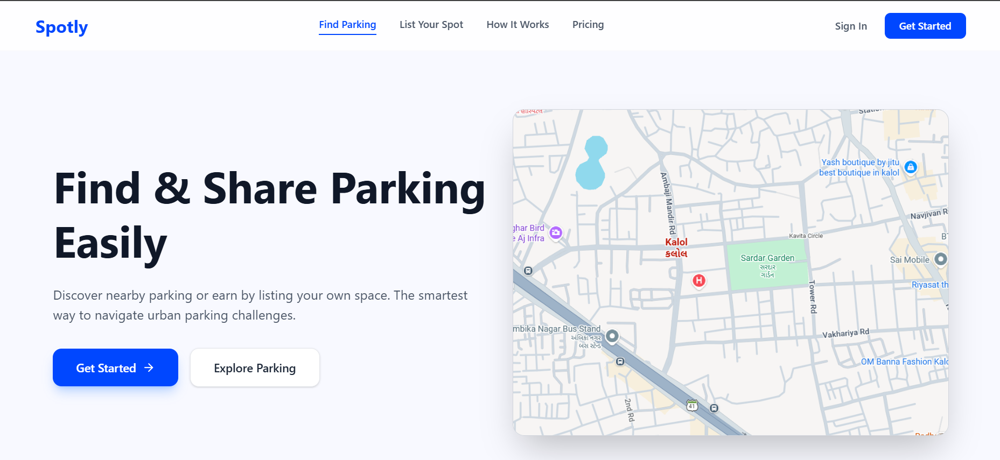
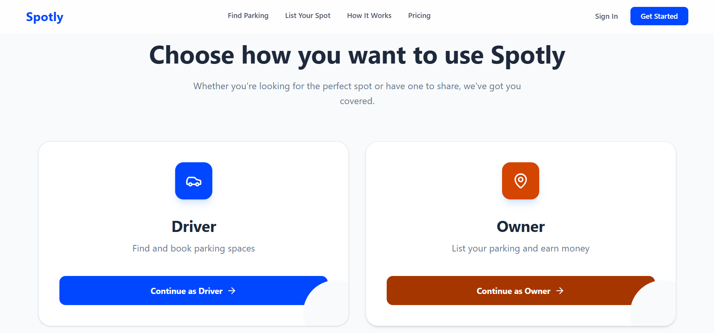
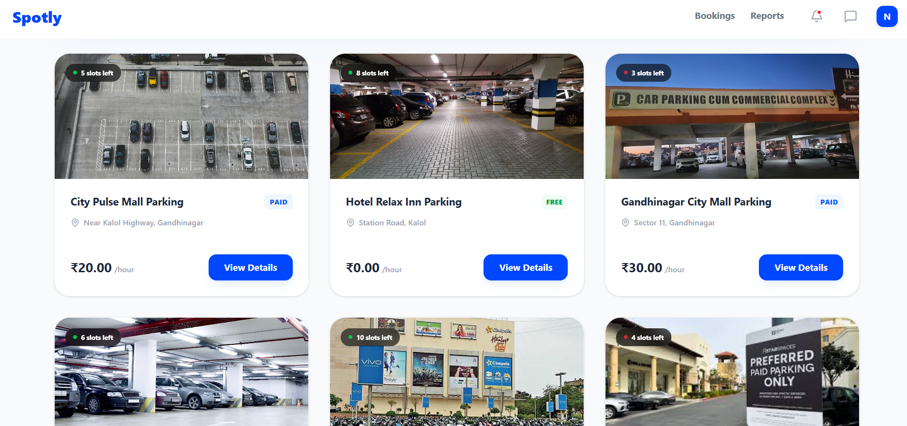
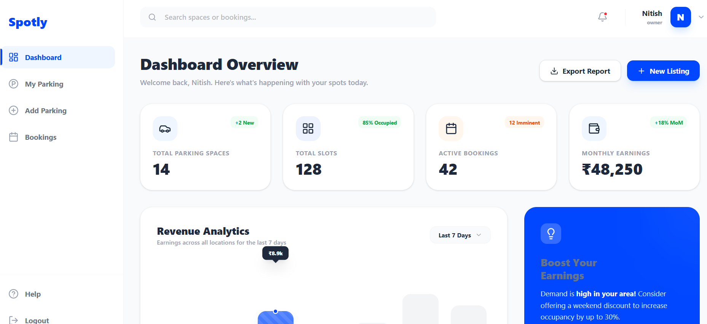

# Spotly 🚗

<div align="center">
  <h3>Find & Share Parking Easily</h3>
  <p>A smart parking marketplace that helps users find nearby parking spaces and allows private owners to list and earn from their unused parking areas.</p>
</div>

---

## 🔗 Important Links

| Resource | Link |
| :--- | :--- |
| 🎨 **Figma Design** | [View Design Prototype](https://www.figma.com/design/Q5g11pgHEQtMWXtZdnLAz7/Full-stack-projects?node-id=0-1&t=X0VDPF3yi9j4xYZw-1) |
| 🌐 **Live Project** | [Spotly Web App](https://spotly-smart-parking.vercel.app/) |
| 📄 **Postman Documentation** | [API Reference](https://documenter.getpostman.com/view/50841011/2sBXqKnewT) |
| ⚙️ **Backend Deployed** | [Server API](https://spotly-j3k4.onrender.com) |
| 🎥 **YouTube Demo** | [Watch Demo Video](https://youtu.be/kfjJECDTpZY?si=UMcj2e4Mybfq9lex) |

---

## 📌 Problem Statement

**"Why do drivers circle markets for 20 minutes finding parking?"**

Shoppers and visitors in crowded areas waste significant time searching for parking, leading to traffic congestion, fuel wastage, and frustration. At the same time, many private spaces remain unused due to lack of visibility and access.

📊 **Problem Validation:**
- 🔴 **Severity Score:** 6
- 💰 **TAM Score:** 6
- ⚪ **Whitespace Score:** 6.5
- 🔁 **Frequency Score:** 8
- 🔥 **Itch Score:** 81

---

## 💡 Solution — Spotly

Spotly solves this problem by creating a **parking marketplace platform** where:
* Users can find nearby parking spaces instantly.
* Both **Free (mall/hotel)** and **Paid (private)** parking options are available.
* Private owners can list their parking and earn passive income.
* Users can check availability and book slots effortlessly.

---

## ✨ Key Features

### 🟢 Driver Features
* 🔍 **Search:** Find nearby free and paid parking options.
* 📊 **Live Slots:** Check real-time slot availability (Available / Occupied).
* 📅 **Booking System:** Reserve your spot ahead of time.
* 📜 **History:** Track past bookings and expenses.

### 🧑‍💼 Owner Features
* ➕ **Listing Management:** Add and edit parking spaces.
* 💰 **Dynamic Pricing:** Set custom pricing for your paid parking.
* 📊 **Dashboard:** Manage slots, earnings, and operations.
* 📥 **Bookings:** View upcoming and active reservations.

---

## 🖼️ Project Screenshots

<div align="center">
  
  
  <br>
  
  
</div>

---

## 🛠️ Tech Stack

### Frontend
- **Framework:** React.js (Vite)
- **Styling:** Tailwind CSS 4
- **Navigation:** React Router DOM 7
- **Maps:** Leaflet & React-Leaflet
- **Icons:** Lucide React
- **SEO:** React Helmet Async

### Backend
- **Runtime:** Node.js
- **Framework:** Express.js
- **Database:** MongoDB (Mongoose)
- **Authentication:** JWT (JSON Web Tokens) & BcryptJS
- **Middleware:** CORS, Dotenv

---

## 📁 Project Structure

```text
Spotly/
├── backend/
│   ├── config/             # Database connection
│   ├── controllers/        # Business logic for auth, parking, etc.
│   ├── middleware/         # Auth & error handling
│   ├── models/             # Mongoose schemas
│   ├── routes/             # API endpoints
│   └── utils/              # Helper functions
└── frontend/
    ├── src/
    │   ├── components/
    │   │   ├── auth/       # Login & Signup components
    │   │   ├── common/     # Reusable UI (Buttons, Inputs, Modals)
    │   │   └── landing/    # Public Hero, FAQ sections
    │   ├── pages/
    │   │   ├── auth/       # Role Selection, Login pages
    │   │   ├── driver/     # Driver Map, Checkout, Bookings
    │   │   ├── owner/      # Owner Dashboard, Listing Management
    │   │   └── landing/    # Main Landing Page
    │   └── routes/         # Protected & Public routing
    └── public/             # Static assets
```

---

## 🚀 Getting Started

### Prerequisites
- Node.js installed
- MongoDB URI (Atlas or Local)

### Installation

1. **Clone the repository:**
   ```bash
   git clone <repository-url>
   cd spotly
   ```

2. **Backend Setup:**
   ```bash
   cd backend
   npm install
   # Create a .env file with PORT, MONGO_URI, and JWT_SECRET
   npm start
   ```

3. **Frontend Setup:**
   ```bash
   cd ../frontend
   npm install
   npm run dev
   ```

---

## 👨‍💻 Developer
**Nitish Kumar**

---

© 2026 Spotly. Built with ❤️ for smart urban mobility.
